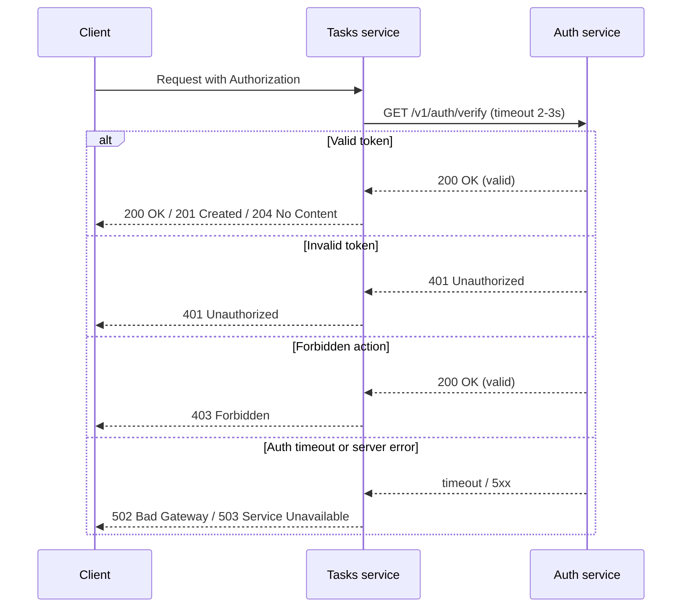

## Имя: Дорджиев Виктор
## Группа: ЭФМО-02-25
# ПЗ №1 — Микросервисы Auth + Tasks

## Цель
Научиться декомпозировать небольшую систему на два сервиса и
организовать корректное синхронное взаимодействие по HTTP (с
таймаутами, статусами ошибок и прокидыванием request-id)

В рамках ПЗ мы делаем учебную систему из двух компонентов:
1) Auth service — отвечает за “проверку доступа”
(упрощённая логика).
2) Tasks service — CRUD задач, но каждый запрос требует
проверки через Auth

## Установка и запуск

(Необходимы предустановленные Go версии 1.22 и выше и Git)

Клонировать репозиторий:

```
git clone <URL_РЕПОЗИТОРИЯ>
cd tech-ip-sem2
```

Команда запуска сервера:

Терминал 1
```
go run ./services/auth/cmd/auth
```
Терминал 2
```
go run ./services/tasks/cmd/tasks
```

## Структура проекта
```plaintext
tech-ip-sem2/
├── go.mod
├── go.sum
├── cmd/
│   ├── auth/
│   │   └── main.go
│   └── tasks/
│       └── main.go
├── internal/
│   ├── auth/
│   │   ├── service/
│   │   │   └── auth.go
│   │   └── http/
│   │       ├── router.go
│   │       └── handlers/
│   │           └── auth.go
│   ├── tasks/
│   │   ├── service/
│   │   │   └── tasks.go
│   │   ├── client/
│   │   │   └── authclient.go
│   │   └── http/
│   │       ├── router.go
│   │       └── handlers/
│   │           └── tasks.go
│   └── shared/
│       ├── httpx/
│       │   └── json.go
│       └── middleware/
│           ├── logging.go
│           └── requestid.go
├── docs/
│   ├── pz1_api.md
│   └── pz1_diagram.md
├── README.md
└── .gitignore
```

## Границы ответственности
Auth service
* выдаёт “токен” (упрощённо),
* проверяет токен,
* возвращает информацию: валиден/не валиден.

Tasks service
* хранит и управляет задачами,
* перед выполнением операций проверяет токен через Auth.

## Схема взаимодействия


## Список эндпоинтов (Auth и Tasks)

- Auth service
  - `POST /v1/auth/login`
  - `GET /v1/auth/verify`
- Tasks service
  - `POST /v1/tasks`
  - `GET /v1/tasks`
  - `GET /v1/tasks/{id}`
  - `PATCH /v1/tasks/{id}`
  - `DELETE /v1/tasks/{id}`


## Учётные данные для demo

- username: `student`
- password: `student`
- token: `demo-token`

## Скриншоты
### Скрин/лог с request-id, подтверждающий прокидывание.


### Получить токен

```
http://185.250.46.179:8081/v1/auth/login
```


### Проверка токена напрямую

```
http://185.250.46.179:8081/v1/auth/verify
```


### Создать задачу через Tasks (с проверкой Auth)

```
http://185.250.46.179:8082/v1/tasks
```


### Попробовать без токена (должно быть 401)

```
http://185.250.46.179:8082/v1/tasks
```


